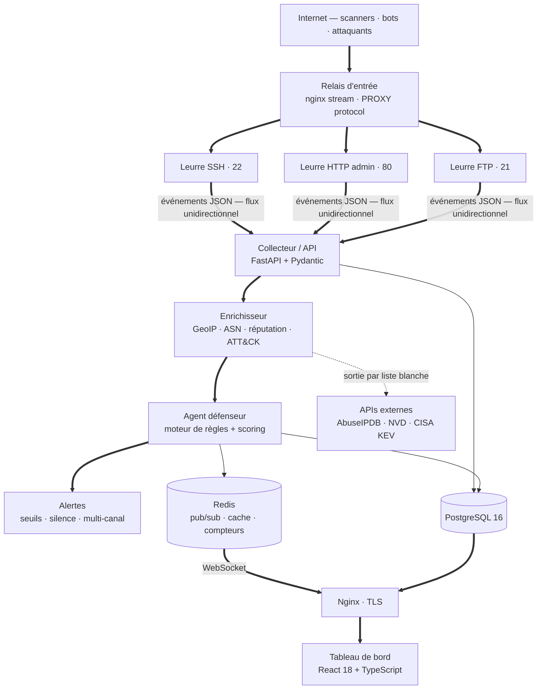
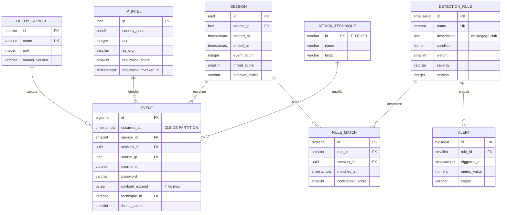

# SHIELD

**S**andbox & **H**oneypot for **I**ntelligent **E**ngagement, **L**earning & **D**efense

> Un honeypot léger qui transforme les attaques que vous subissez déjà en un tableau de
> bord lisible — déployable en moins de dix minutes, sans jamais exposer votre véritable
> infrastructure.

Projet de fin de formation — **Ryan** (back-end & sécurité) et **Antho** (front-end & DevOps).

---

## Le problème

Tout serveur connecté à Internet est visité en permanence par des programmes
automatiques qui cherchent une porte mal fermée. Une étude de l'Unit 42 de Palo Alto
Networks a observé **75 000 adresses de scanners uniques par jour**, énumérant plus de
**9 500 ports différents** ; **64 % de ces adresses n'apparaissent qu'une seule fois**,
ce qui rend les listes de blocage statiques largement inopérantes.

Un amateur auto-hébergeur, une association ou une PME de trente personnes n'a ni SOC,
ni SIEM, ni analyste. Ces structures ne découvrent pas les tentatives d'intrusion :
elles découvrent l'intrusion **réussie**, souvent plusieurs semaines plus tard.

Les outils existants ne comblent pas ce vide : les uns produisent des journaux bruts
qu'il faut savoir exploiter, les autres coûtent un abonnement annuel.

## Ce que fait SHIELD

1. **Il attire.** Trois services leurres — SSH, page d'administration HTTP, FTP —
   imitent des cibles attractives. Ils **n'exécutent strictement rien** : ils présentent
   une bannière, lisent la tentative, l'enregistrent intégralement, et refusent.
2. **Il qualifie.** Chaque tentative est enrichie (pays, opérateur réseau, réputation,
   technique MITRE ATT&CK) puis évaluée par un **agent défenseur** qui attribue un score
   de menace et un profil d'attaquant.
3. **Il explique.** Le score n'est jamais une boîte noire : chaque point est attribué à
   une règle nommée, décrite en français, dont la contribution est affichée. La somme
   des contributions est **exactement** égale au score.
4. **Il alerte.** Au franchissement d'un seuil configurable, une notification part —
   une seule par franchissement — avec un lien vers la vue déjà filtrée.
5. **Il entraîne.** Une **sandbox** en réseau totalement isolé permet à un membre de
   l'équipe de jouer l'attaquant et à l'autre le défenseur, et mesure objectivement ce
   que l'agent détecte et ce qu'il manque.

---

## Architecture



### Le principe directeur : le flux unidirectionnel

**C'est le point d'architecture à retenir avant tous les autres.** Les leurres écrivent
vers le collecteur, jamais l'inverse. Ils n'ont aucune route vers Internet, aucun accès
à la base, aucun secret, et aucun voisin joignable.

Conséquence : **même si un leurre était compromis, l'attaquant se retrouverait dans un
conteneur sans réseau sortant, sans système de fichiers inscriptible et sans identifiant
réutilisable.** Il ne pourrait ni rebondir vers un tiers, ni remonter vers le reste du
système.

Cette contrainte est appliquée par Docker lui-même : `decoy_net` et `ingest_net` sont
déclarés `internal`. Ce n'est pas une règle de pare-feu que l'on peut oublier de
charger, c'est une propriété du réseau.

Docker ne publiant pas les ports d'un conteneur relié seulement à des réseaux internes,
Internet atteint les leurres par un **relais d'entrée** (`edge`) qui ne fait que
transmettre les octets, et leur passe l'adresse réelle de l'attaquant par le PROXY
protocol ([ADR 008](docs/adr/008-relais-d-entree-des-leurres.md)).

| Zone | Contenu | Sortie Internet |
| :--- | :--- | :---: |
| **Entrée** | Relais `edge` (nginx stream), seul conteneur publié sur les ports des leurres | Réseau ouvert, ne relaie que vers les leurres |
| **Leurre** | Les trois services exposés | **Aucune** |
| **Traitement** | Collecteur, enrichisseur, agent défenseur, alertes, veille | Liste blanche |
| **Données** | PostgreSQL, Redis | Aucune |
| **Présentation** | Nginx, tableau de bord | Entrée TLS uniquement |

---

## Modèle de données



**Quatre décisions de modélisation et leur raison :**

| Décision | Pourquoi |
| :--- | :--- |
| `source_ip` en type **`INET`** natif | PostgreSQL indexe, compare et agrège nativement les adresses, et permet les requêtes par sous-réseau sans découper de chaîne |
| `event` **partitionnée par mois** | La purge RGPD devient un `DROP PARTITION` instantané au lieu d'un `DELETE` massif qui verrouille la table |
| `rule_match` en **table dédiée** | L'explicabilité exige de répondre à « quelles règles, combien de fois, sur quelle période » : c'est une agrégation, pas une lecture de document |
| `password` stocké **en clair** | Ce ne sont pas des mots de passe d'utilisateurs légitimes, mais ceux que des attaquants **testent**. Leur valeur analytique est dans leur contenu. Ils sont exclus de tout export public |

---

## Démarrage rapide

### Développement local

```bash
git clone https://github.com/<owner>/shield.git && cd shield
make install                  # environnement virtuel + dépendances + pre-commit
cp .env.example .env          # puis renseignez INGEST_TOKEN et les mots de passe

make run-api                  # terminal 1 — collecteur sur :8000
make fake                     # terminal 2 — flux d'événements factices
```

```bash
curl -s localhost:8000/api/v1/stats/overview
# {"events":412,"unique_ips":308,"sessions":357,"max_threat_score":86,"rejected":0}
```

Le **générateur d'événements factices** permet de développer tout le tableau de bord
sans qu'aucun leurre ne tourne. C'est ce qui permet aux deux lanes de travailler en
parallèle plutôt qu'en série.

### Vérifier l'explicabilité du score

```bash
curl -s "localhost:8000/api/v1/events?min_score=60&limit=1"          # récupérer un event_id
curl -s "localhost:8000/api/v1/events/<event_id>/verdict" | jq
```

```json
{
  "threat_score": 68,
  "profile": "tentative_exploitation",
  "matches": [
    { "rule_id": "R-005", "name": "silent-port-probe",        "weight": 8,  "contribution": 8  },
    { "rule_id": "R-010", "name": "command-injection-attempt","weight": 60, "contribution": 60 }
  ]
}
```

`8 + 60 = 68`. C'est l'invariant que `Verdict.is_consistent()` vérifie et qu'un test
unitaire protège.

### Déploiement complet

```bash
cp .env.example .env && $EDITOR .env      # INGEST_TOKEN, POSTGRES_PASSWORD, JWT_SECRET
docker compose up -d
docker compose ps
```

### Sandbox d'entraînement

```bash
./scripts/sandbox.sh start --scenario bruteforce-ssh
./scripts/sandbox.sh attacker     # dans un autre terminal
./scripts/sandbox.sh report
./scripts/sandbox.sh stop
```

La sandbox refuse de démarrer si `SHIELD_ENV=prod`, et son réseau est déclaré
`internal` : aucune action d'entraînement ne peut sortir de la machine.

### Arrêt d'urgence

```bash
./scripts/emergency_stop.sh    # coupe l'exposition, conserve toutes les données
```

---

## Tests

```bash
make test        # tests unitaires
make test-cov    # + couverture, seuil 80 % sur les zones critiques
make check       # tout ce que la CI vérifie, en local
make load        # test de charge : 3 000 événements en 60 s
```

| Niveau | Ce qui est testé | Où |
| :--- | :--- | :--- |
| **Unitaire** | Analyse d'événements, sessions, correspondance ATT&CK, moteur de règles, scoring | `tests/unit/` |
| **Intégration** | Ingestion → base → enrichissement → verdict, avec PostgreSQL et Redis réels | `tests/integration/` (CI) |
| **Contrat** | Les types TypeScript correspondent aux modèles Pydantic | CI, `gen_ts_types --check` |
| **Charge** | 3 000 événements en 60 s, zéro perte | CI, job `load` |
| **Sécurité** | `bandit`, `pip-audit`, `gitleaks`, `trivy` | CI, job `security` |
| **Bout en bout** | Les 4 parcours utilisateurs | `tests/e2e/` (Playwright) |

Quelques tests méritent une mention, parce qu'ils encodent une exigence plutôt qu'un
comportement :

- **`test_aucun_leurre_ne_peut_executer_quoi_que_ce_soit`** — analyse le code source des
  leurres et échoue si `eval`, `exec`, `subprocess` ou `os.system` y apparaissent. C'est
  l'invariant de sécurité R1, vérifié automatiquement plutôt que promis.
- **`test_aucun_leurre_ne_revele_son_identite`** — aucune réponse réseau ne doit
  contenir « shield », « honeypot » ou « leurre ».
- **`test_le_verdict_est_deterministe`** — le même jeu d'événements rejoué vingt fois
  produit exactement le même score et le même profil.
- **`test_charges_malveillantes_sont_stockees_inertes`** — binaire pur, UTF-8 invalide,
  injections SQL, XSS, traversée de répertoire : tout est accepté, rien n'est interprété,
  rien ne lève.

---

## Pile technique

| Couche | Technologie | Justification |
| :--- | :--- | :--- |
| Leurres | Python 3.12, `asyncio`, sockets bas niveau | Manipulation fine des protocoles sans bibliothèque qui en ferait trop ; émulation de bannières uniquement, jamais de shell |
| Collecteur / API | FastAPI, Pydantic, SQLAlchemy | **Validation stricte des entrées** — essentielle quand l'entrée est fournie par des attaquants |
| Agent défenseur | Moteur de règles maison, règles déclaratives en YAML | Explicable, déterministe, testable, et fonctionnel dès le premier événement |
| Base de données | PostgreSQL 16 | Requêtes analytiques, type `INET`, partitionnement natif pour la purge RGPD |
| Temps réel | Redis (pub/sub) + WebSocket | Diffusion sans interrogation périodique ; sert aussi de cache et de compteurs |
| Front-end | React 18, **TypeScript**, Vite, TailwindCSS, Recharts, MapLibre GL | Le contrat d'événement devient un type partagé : une rupture casse la compilation, pas la démonstration |
| Infrastructure | Docker Compose, Nginx, Let's Encrypt | L'isolation par conteneur est ici une **exigence de sécurité**, pas un confort de déploiement |
| CI | GitHub Actions | Lint, tests, sécurité, charge et build à chaque PR |

**Pourquoi un moteur de règles plutôt que de l'apprentissage automatique ?** Parce que
l'explicabilité prime : un utilisateur non expert doit comprendre *pourquoi* une session
est notée 72/100. S'ajoute le fait qu'un modèle non supervisé sans historique produirait
surtout des faux positifs — et qu'un score que l'on ne peut pas justifier devant un jury
n'a aucune valeur. Le prix payé est réel et assumé : un moteur de règles ne détecte que
ce pour quoi une règle existe.

---

## Structure du dépôt

```
shield/
├── src/shield/
│   ├── common/schema.py          # LE contrat d'événement — point de couplage unique
│   ├── decoys/                   # Zone leurre : base + ssh + http + ftp
│   ├── collector/
│   │   ├── api/                  # Routes FastAPI
│   │   ├── ingest/               # Validation, regroupement en sessions
│   │   ├── enrichment/           # GeoIP, réputation, MITRE ATT&CK
│   │   ├── defender/             # Moteur de règles, scoring, profilage
│   │   └── alerts/               # Seuils, canaux, période de silence
│   └── tools/                    # Générateur d'événements, génération des types TS
├── rules/detection_rules.yaml    # Les règles de détection, en clair
├── dashboard/                    # React + TypeScript
├── deploy/                       # Dockerfiles, Nginx, durcissement
├── docs/
│   ├── SPRINT_PLAN.md            # Plan de sprints de l'étape 4
│   ├── METRICS.md                # Vélocité, bugs, qualité
│   ├── adr/                      # Décisions d'architecture
│   ├── sprints/                  # Revues et rétrospectives
│   └── templates/                # Gabarits des rituels
├── scripts/                      # setup_github, sandbox, arrêt d'urgence
└── tests/
```

## Contribuer (conventions d'équipe)

- `main` est **protégée** : aucune poussée directe, une approbation obligatoire, CI verte.
- Branches courtes : `feat/`, `fix/`, `docs/`, `chore/` — moins de 3 jours de vie.
- Commits au format **Conventional Commits** : `feat(collector): add ASN enrichment`.
- PR de **moins de 400 lignes** : une PR trop grosse n'est pas relue, elle est approuvée par lassitude.
- Toute PR touchant `src/shield/decoys/` exige une **vérification explicite de l'invariant de sécurité**.
- Toute décision structurante fait l'objet d'un **ADR** dans `docs/adr/`.

## Vie privée et conformité

| Point | Traitement |
| :--- | :--- |
| Base légale | Intérêt légitime — sécurité du système d'information |
| Minimisation | Aucune donnée collectée en dehors de l'événement d'attaque lui-même |
| Conservation | 12 mois par défaut, configurable, purge quotidienne journalisée |
| Pseudonymisation | Troncature du dernier octet des adresses IPv4 sur toute donnée publiée |
| Exclusion définitive | Aucune riposte active, aucun honeypot à forte interaction, aucune exécution de charge malveillante |

## Licence

MIT — voir [LICENSE](LICENSE).

Les référentiels et bases tiers (MaxMind GeoLite2, AbuseIPDB, MITRE ATT&CK, CISA KEV)
restent soumis à leurs licences respectives, attribuées dans `docs/THIRD_PARTY.md`.
